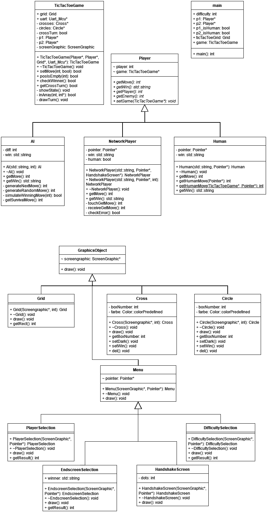

# Projektinfo

Embedded C++ [Thomas Breuer](https://github.com/ThBreuer) SS24 [Hochschule Bonn-Rhein-Sieg](https://www.h-brs.de/)
## Hardware

Microcontroller: STM32F769I-DISCO Display: MB1166 Rev. A Erweiterungsboard: STM32F769-Disco Extension-Board UART (S3): Verbunden, jeweils RX-Pin an TX-Pin

## Software

Entwickelt mit STM32CubeIDE => EmBlitz & uVision unbenutzt Modifizierte Version der [EmbSysLib](https://github.com/FireFly08151/EmbSysLib) (Erweiterung um uart7)

# Dokumentation
## Software-Architektur

## Methode
### Vorgehen

1. Zunächst haben wir das Display in Betrieb genommen. Dies war ein kritischer Schritt, da die visuelle Ausgabe eine zentrale Rolle für das Projekt ist. Durch die korrekte Ansteuerung des Displays können nun alle weiteren Funktionen und Ergebnisse klar und verständlich dargestellt werden.
2. Die grundlegende Spiellogik wurde vollständig implementiert. Dies umfasst die Regeln und Mechaniken des Spiels, die sicherstellen, dass das Spiel wie beabsichtigt funktioniert.
3. Ein weiterer wichtiger Meilenstein war die Einführung eines virtuellen Gegners, der zufällige Züge macht. Dies ermöglicht es den Spielern, auch ohne menschlichen Mitspieler gegen den Computer anzutreten. Der Zufallsgenerator sorgt dabei für eine abwechslungsreiche Spielerfahrung.
4. Die Softwarearchitektur wurde durch die Implementierung einer klaren Klassenhierarchie weiter strukturiert. Dies verbessert nicht nur die Übersichtlichkeit des Codes, sondern erleichtert auch zukünftige Erweiterungen und Wartungen. Jede Klasse erfüllt dabei spezifische Aufgaben und trägt zur Modularität des Projekts bei.
5. Um das Spiel herausfordernder und spannender zu gestalten, haben wir mehrere Schwierigkeitsstufen für den virtuellen Gegner eingeführt. Dies ermöglicht es den Spielern, den Schwierigkeitsgrad an ihre individuellen Fähigkeiten anzupassen und sorgt für langfristigen Spielspaß.
6. Schließlich haben wir eine Netzwerkfunktion über UART (Universal Asynchronous Receiver Transmitter) implementiert. Diese Funktion ermöglicht die Kommunikation zwischen verschiedenen Geräten und eröffnet die Möglichkeit für Mehrspieler-Modi über ein Netzwerk. Die Nutzung von UART gewährleistet eine zuverlässige und schnelle Datenübertragung.

### Probleme

- Neue Dateien wurden mit absoluten Pfaden in der Projektdatei gespeichert, was bei der Entwicklung auf mehreren Geräten zu Problemen führte. Relative Pfade lösen dieses Problem.
- Die UART-Schnittstelle S1 hat einen Pull-Up-Wiederstand auf einer Datenleitung, wodurch die Übertragung nicht möglich ist. Deshalb haben wir die Library um uart7 erweitert, um die Schnittstelle S3 benutzen zu können.
- Um die Spielreihenfolge beim Handshake über UART zufällig festzulegen, lassen beide Microcontroller eine Flut von Nachrichten auf den anderen einwirken, bis sie sich über die Reihenfolge einig sind.
## Abweichungen zum Lastenheft
### Spielregeln

**Gemäß Lastenheft:**
Auf einem quadratischen, 3×3 Felder großen Spielfeld setzen zwei Spieler abwechselnd ihr Zeichen (ein Spieler Kreuze, der andere Kreise) in ein freies Feld. Der Spieler, der als Erster drei Zeichen in eine Zeile, Spalte oder Diagonale setzen kann, gewinnt. ~~Wenn alle neun Felder sind gefüllt, ohne dass ein Spieler die erforderlichen Zeichen in einer Reihe, Spalte oder Diagonalen setzen konnte, ist das Spiel unentschieden.~~

**Abänderung:**
Die Züge jedes Spielers werden in einer Liste gespeichert. Wenn die Liste eine Länge von drei Einträgen erreicht hat, wird mit jedem weiteren Zug der erste Eintrag in der Liste gelöscht, die anderen Einträge rutschen auf und der neue Eintrag wird an hinterster Stelle hinzugefügt.

### Spielgestaltung

**Gemäß Lasteheft:**
Das Spiel kann in den Varianten Mensch gegen Mensch oder Mensch gegen Computer gespielt werden.
Nach dem Booten des Controllers erscheinen die Tic-Tac-Toe-Spielfläche mit den erforderlichen Einstellmöglichkeiten.
Der Spieler markiert das Feld, in dem sein Zeichen gesetzt werden soll, durch Berühren des Bildschirms. Mit einer angemessen Verzögerung besetzt dann der Computer ein Feld.
Die Zeichen sollen im Spielfeld gut erkennbar und farbig sein.
Die Spielentscheidung wird textuell ausgegeben. Mit Betätigung eines Buttons kann das Spiel jederzeit neu gestartet werden.
**Ergänzung:**
Das Spiel kann in der Variante "Mensch gegen Mensch" sowohl lokal, als auch über UART auf zwei Microcontrollern gespielt werden. Das Spiel bietet in der Variante "Mensch gegen Computer" die Möglichkeit, gegen drei unterschiedliche Schwierigkeitsstufen anzutreten.

## Änderungen an gegebenem Code (EmbSysLib & Resources)
- Inclusion guard zu Color.h in Resources hinzugefügt
- uart7 zum EmbSysLib hinzugefügt

## Testdokumentation

Was passiert, wenn die Verbindung zwischen den Spielern unterbrochen wird?
- Ein Verbindungseinbruch wirkt sich nur auf das Spiel aus, wenn bei unterbrochener Verbindung ein Zug getätigt wird. Dadurch sendet ein Spieler die Information des Zuges, welche allerdings von dem anderen Spieler nicht empfangen wird. Wenn die Verbindung danach wieder hergestellt wird, warten beide Spieler dadurch auf einen Zug des jeweilig anderen Spielers.

| Spieler   | Freund         | Computer inkompetent              | Computer realistisch              | Computer Gut              | Netzwerk                        |
| --------- | -------------- | --------------------------------- | --------------------------------- | ------------------------- | ------------------------------- |
| Spielmodi | `Gegen Freund` | `Gegen Computer` -> `Inkompetent` | `Gegen Computer` -> `Realistisch` | `Gegen Computer` -> `Gut` | `Netzwerk Spiel` -> `Handshake` |

| Test                                      | Vorbedingung                                                    | Ablauf                                                                                                                          | Ergebnis                                                                                 | Erfolgreich | Zusätzliche Informationen                                                                                             |
| ----------------------------------------- | --------------------------------------------------------------- | ------------------------------------------------------------------------------------------------------------------------------- | ---------------------------------------------------------------------------------------- | ----------- | --------------------------------------------------------------------------------------------------------------------- |
| Spielmodus auswählen                      | Mikrocontroller ist eingesteckt und zurückgesetzt               | Benutzer wählt den Spielmodus aus                                                                                               | Spiel oder Untermenü öffnet sich                                                         | ✅           | Da die Menüs und Spielmodi mit Vererbung implementiert sind, müssen nicht alle Fälle einzeln getestet werden.         |
| Spielfiguren werden korrekt gesetzt       | Spielmodus wurde ausgewählt                                     | Basierend auf dem Spielmodus wird ein Zug durch den Computer gesetzt, oder ein Zug von dem Spieler durch Toucheingabe erwartet. | Spielfigur wird korrekt gesetzt                                                          | ✅           | Da die Platzierung der Spielfiguren mit Vererbung implementiert ist, müssen nicht alle Fälle einzeln getestet werden. |
| Der Handshake wird erfolgreich ausgeführt | Die Mikrocontroller sind über den Port S3 miteinander verbunden | Auswahl des Spielmodus `Netzwerk Spiel` auf beiden Geräten                                                                      | Spiel beginnt                                                                            | ✅           | -                                                                                                                     |
| Der Gewinner wird korrekt erkannt         | Einer der Spieler kann mit dem nächsten Zug gewinnen            | Der Spieler führt den gewinnenden Zug aus                                                                                       | Weitere Eingaben werden blockiert und nach einer Verzögerung wird der Gewinner angezeigt | ✅           | -                                                                                                                     |

## Fazit
It just works