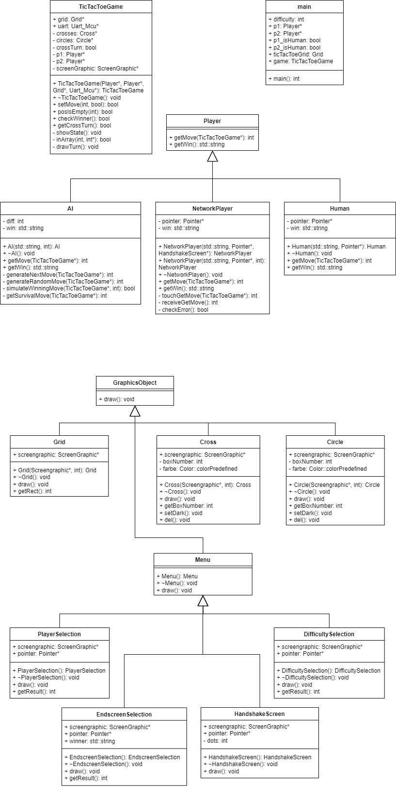

# Dokumentation
## Software-Architektur

## Methode
### Vorgehen
1. Display zum laufen bekommen
2. Spiellogik implementiert
3. Virtuellen Gegner mit zufälligen Zügen
4. Klassenhierachie implementiert
5. Weitere Schwierigkeitsstufen für Virtuellen Gegner
6. Netzwerkfunktion über UART

### Probleme
- UART zum laufen bekommen
	- UART 7 als Schnittstelle verwendet (Library erweitert)
- Beim Handshake über UART zufällig die Spielreihenfolge festlegen
	- Beide Microcontroller fluten den anderen mit Nachrichten, bis sie sich über die Reihenfolge einig sind.
## Abweichungen zum Lastenheft
### Spielregeln
**Gemäß Lastenheft:**
Auf einem quadratischen, 3×3 Felder großen Spielfeld setzen zwei Spieler abwechselnd ihr Zeichen (ein Spieler Kreuze, der andere Kreise) in ein freies Feld. Der Spieler, der als Erster drei Zeichen in eine Zeile, Spalte oder Diagonale setzen kann, gewinnt. ~~Wenn alle neun Felder sind gefüllt, ohne dass ein Spieler die erforderlichen Zeichen in einer Reihe, Spalte oder Diagonalen setzen konnte, ist das Spiel unentschieden.~~
**Abänderung:**
Die Züge jedes Spielers werden in einer Liste gespeichert. Wenn die Liste eine Länge von drei Einträgen erreicht hat, wird mit jedem weiteren Zug der erste Eintrag in der Liste gelöscht, die anderen Einträge rutschen auf und der neue Eintrag wird an hinterster Stelle hinzugefügt.

### Spielgestaltung
**Gemäß Lasteheft:**
Das Spiel kann in den Varianten Mensch gegen Mensch oder Mensch gegen Computer gespielt werden.
Nach dem Booten des Controllers erscheinen die Tic-Tac-Toe-Spielfläche mit den erforderlichen Einstellmöglichkeiten.
Der Spieler markiert das Feld, in dem sein Zeichen gesetzt werden soll, durch Berühren des Bildschirms. Mit einer angemessen Verzögerung besetzt dann der Computer ein Feld.
Die Zeichen sollen im Spielfeld gut erkennbar und farbig sein.
Die Spielentscheidung wird textuell ausgegeben. Mit Betätigung eines Buttons kann das Spiel jederzeit neu gestartet werden.
**Ergänzung:**
Das Spiel kann in der Variante "Mensch gegen Mensch" sowohl lokal, als auch über UART auf zwei Microcontrollern gespielt werden. Das Spiel bietet in der Variante "Mensch gegen Computer" die Möglichkeit, gegen drei unterschiedliche Schwierigkeitsstufen anzutreten.

## Änderungen an EmbSysLib
- Inclusion guard zu hinzugefügt Color.h
- uart7 hinzugefügt

## Testdokumentation
Der aktuelle Stand der Entwicklung wurde nach jeder Änderung auf Fehler überprüft. Neue Funktionen bauen auf den vorherigen auf, welche bereits getestet wurden.

Was passiert, wenn die Verbindung zwischen den Spielern unterbrochen wird?
- Ein Verbindungseinbruch wirkt sich nur auf das Spiel aus, wenn bei unterbrochener Verbindung ein Zug getätigt wird. Dadurch sendet ein Spieler die Information des Zuges, welche allerdings von dem anderen Spieler nicht empfangen wird. Wenn die Verbindung danach wieder hergestellt wird, warten beide Spieler dadurch auf einen Zug des jeweilig anderen Spielers.

| Spieler   | Freund         | Computer inkompetent              | Computer realistisch              | Computer Gut              | Netzwerk                        |
| --------- | -------------- | --------------------------------- | --------------------------------- | ------------------------- | ------------------------------- |
| Spielmodi | `Gegen Freund` | `Gegen Computer` -> `Inkompetent` | `Gegen Computer` -> `Realistisch` | `Gegen Computer` -> `Gut` | `Netzwerk Spiel` -> `Handshake` |

| Test                                      | Vorbedingung                                                    | Ablauf                                                                                                                          | Ergebnis                         | Erfolgreich | Zusätzliche Informationen                                                                                             |
| ----------------------------------------- | --------------------------------------------------------------- | ------------------------------------------------------------------------------------------------------------------------------- | -------------------------------- | ----------- | --------------------------------------------------------------------------------------------------------------------- |
| Spielmodus auswählen                      | Mikrocontroller ist eingesteckt und zurückgesetzt               | Benutzer wählt den Spielmodus aus                                                                                               | Spiel oder Untermenü öffnet sich | ✅           | Da die Menüs und Spielmodi mit Vererbung implementiert sind, müssen nicht alle Fälle einzeln getestet werden.         |
| Spielfiguren werden korrekt gesetzt       | Spielmodus wurde ausgewählt                                     | Basierend auf dem Spielmodus wird ein Zug durch den Computer gesetzt, oder ein Zug von dem Spieler durch Toucheingabe erwartet. | Spielfigur wird korrekt gesetzt  | ✅           | Da die Platzierung der Spielfiguren mit Vererbung implementiert ist, müssen nicht alle Fälle einzeln getestet werden. |
| Der Handshake wird erfolgreich ausgeführt | Die Mikrocontroller sind über den Port S3 miteinander verbunden | Auswahl des Spielmodus `Netzwerk Spiel` auf beiden Geräten                                                                      | Spiel beginnt                    | ✅           | -                                                                                                                     |

## Fazit
It just works